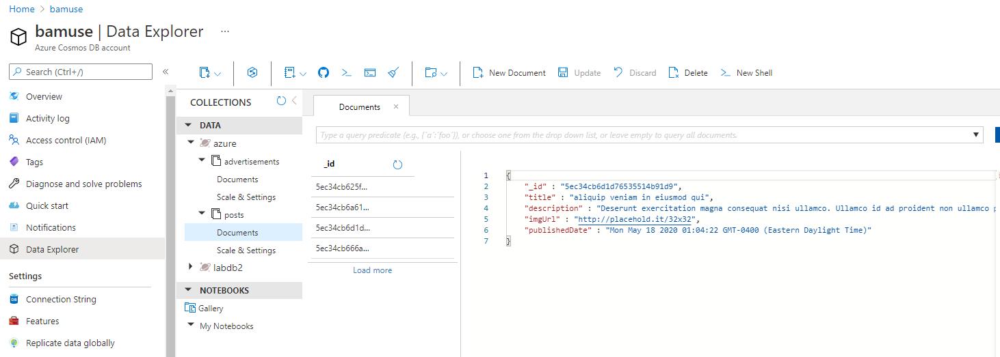

# A screenshot from the Azure portal showing the database & collections

# Triggers in Azure - A screenshot, including URL

# Triggers Connect to Database - A screenshot, including URL

# Logic Apps & Event Hubs

# Deploying Your Application
## App Service Deployment - The live url from Azure App Service 

## Dockerfile - A screenshot of the Dockerfile from Azure Container Registry

## Kubernetes - A screenshot of confirmation from the terminal, or from within Azure
